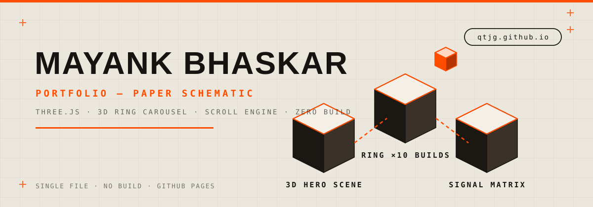
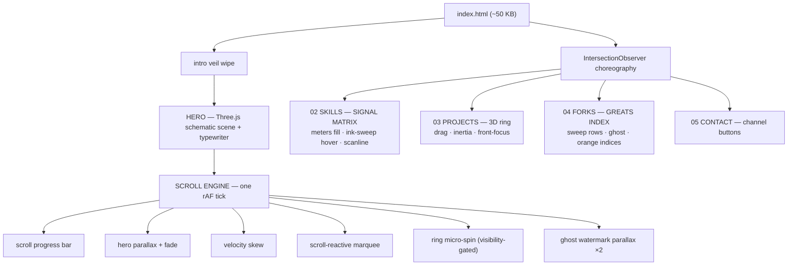

<div align="center">
  

  # 🧭 qtjg.github.io

  **A 3D portfolio drawn like a paper schematic — ink, grid paper and one loud signal-orange.**
  One HTML file. Zero build. A real Three.js scene inside.

  [**🚀 LIVE → qtjg.github.io**](https://qtjg.github.io)

  
  
  
  
  

</div>

---

## ⚡ What is this

Most portfolios are a screenshot of a person pretending to be a company. This one is a
**living schematic**: every section is rendered like an engineering drawing — monospaced
annotations, hairline rules, index numbers, and a hand-drawn 3D scene that floats behind
the hero. The palette is strict on purpose: `#ece7dd` paper, `#161310` ink, `#ff4d00`
signal orange. Nothing else is allowed in.

Everything ships in a **single `index.html`** (~50 KB) with zero dependencies and zero
build steps. Fonts and Three.js come from CDN; everything else — the scroll engine, the
3D carousel, the reveal choreography — is hand-rolled vanilla JS in one file.

## 🧊 The 3D layer

Three genuinely 3D things live in this site:

| # | Element | What it does |
|---|---------|--------------|
| 01 | **Schematic hero scene** | A Three.js wireframe assembly — grid plane, ink-solid geometry and an orange beacon — floating in perspective, parallaxing against scroll |
| 02 | **3D ring carousel** | All 10 original builds arranged on a real 3D ring (`rotateY` + `translateZ`). Drag to spin, inertia decays, front card focuses, arrows kick it |
| 03 | **Isometric ghost layer** | Every redesigned section carries an outlined ghost word (CRAFT / GREATS) with scroll parallax, plus a scanline sweep on entry |

The ring, from the inside out:

```text
             ╱▔▔▔▔▔▔▔╱▎
            ╱  ▶ 01 ╱ ╱▎      10 cards · rotateY(i·36°) · translateZ(520px)
           ╱▁▁▁▁▁▁▁╱ ╱▎      drag → velocity → decay ·.94 per frame
           ▏ card  ▏╱        front-focus dims faces > 52° off-axis
           ▏▁▁▁▁▁▁▁▏
```

## 🗺️ Architecture

One request, one file, one `requestAnimationFrame` loop driving everything:



## ✨ Feature matrix

- **Scroll engine** — one rAF loop: progress bar, hero parallax, velocity-based skew,
  marquee that speeds up and reverses with your scroll, nav scroll-spy + auto-hide
- **SIGNAL MATRIX** — every skill row carries a 5-tick signal meter that fills bar-by-bar
  on reveal; hovering sweeps a full ink band across the row and flips it paper-white
- **Cursor spec-tag** — a terminal readout follows the mouse over skills and forks
  (`SIG 5/5 · TYPESCRIPT`, `FORK 04 · GITHUB/QTJG/TRIVY`)
- **Back-to-top pointer** — 56 px button with a circular SVG progress ring that fills
  with scroll percentage and springs in after 560 px
- **Intro veil** — ink + orange double-panel wipe on load, hero children stagger in behind it
- **Magnetic buttons** — CTA and nav buttons attract toward the cursor
- **Reduced-motion safe** — every animation degrades to a calm static layout via
  `prefers-reduced-motion`

## 🧱 Tech stack

| Layer | Choice | Why |
|-------|--------|-----|
| Rendering | Three.js 0.158 (CDN, ES module) | the only heavy dep; powers hero + ring |
| Type | Bebas Neue · Cormorant Garamond · Jost · IBM Plex Mono | display / serif / body / schematic |
| Motion | hand-rolled rAF engine + IntersectionObserver | no GSAP, no Lenis, no bloat |
| Hosting | GitHub Pages | commit = deploy |

## 📜 Version log

| Ver | Codename | What landed |
|-----|----------|-------------|
| v1 | Starfield | first Three.js hero |
| v2 | Ember Editorial | rose/amber editorial layout (retired — too "AI slop") |
| v3 | Paper Schematic | paper + ink + orange, 3D ring, terminal covers |
| v3.1 | Scroll Engine | parallax, skew, marquee, scroll-spy, reveals |
| v3.2 | Pointer | back-to-top button with circular progress ring |
| v3.3 | Motion Pass | intro veil, magnetic buttons, nav auto-hide, card hover pop |
| v3.4 | Signal Matrix | skills section: meters, ink-sweep, scanline, ghost, spec-tag |
| v3.5 | Greats Index | forks section gets the same signal treatment |
| v3.6 | Channels | YouTube + Discord wired into contact + footer |

## 🚀 Run locally

```bash
git clone https://github.com/qtjg/qtjg.github.io
cd qtjg.github.io
python3 -m http.server 8899
# open http://localhost:8899
```

…or just open `index.html` directly in a browser. There is nothing to install.

## 📡 Channels

<div align="center">

[](https://www.youtube.com/@indiancybersecurity/videos)
[](https://discord.gg/Rk66PWavc)
[](https://github.com/qtjg)
[](https://twitter.com/mayankbhaskarr)

</div>

---

<div align="center">
  <sub><b>DRAWN BY HAND · RENDERED BY THREE.JS · NO AI SLOP</b></sub>
</div>
